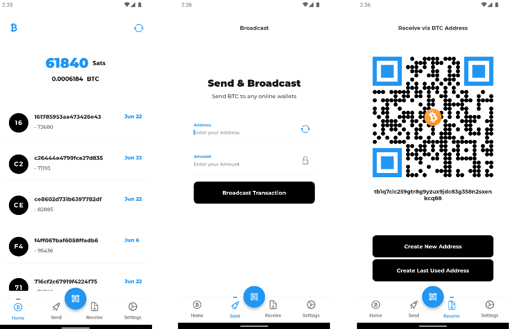

# BDK-Flutter Demo App

Demo App for BDK-Flutter, a Flutter version of BDK

BDK-Flutter: https://github.com/LtbLightning/bdk-flutter
BDK: https://github.com/bitcoindevkit/bdk
 

<div align="center"> 
</div>
  
##   
The _BDK-Flutter Demo App_ is a simple testnet Bitcoin wallet built with Flutter as a reference app for the BDK-Flutter package
https://github.com/LtbLightning/bdk-flutter.git

## Installation 
```bash git clone https://github.com/LtbLightning/bdk-flutter-app.git ``` 

```bash flutter pub get```

```flutter run ```
